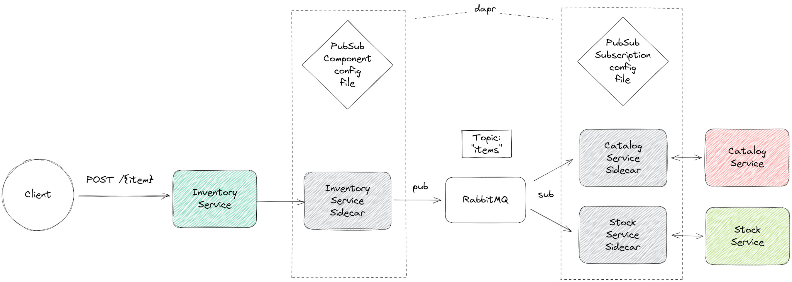

# dapr example - publish-subscribe

<a href="https://www.dapr.io/"></a>

The following scenario is implemented here.



A client posts a new item to the inventory service.
Thereupon, the inventory service creates and publishes an item data record
on the RabbitMQ topic called "_items_".
The other two services, catalog and stock are subscribers of that topic.
Both receive the data record and react individually.

However, all three services do not communicate directly with RabbitMQ.
Instead, they each delegate Pub/Sub operations to their dapr sidecars. 
The dapr sidecars take over the direct communication with RabbitMQ.


## Pub/Sub Component

_dapr_ uses yaml files to specify both, the [_Pub/Sub component_](https://docs.dapr.io/operations/components/setup-pubsub/) 
(RabbitMQ in our case) and the _Pub/Sub subscription_ settings.
These files are located in `components/local`.
Using these yaml files enables us to exchange the underlying 
message broker without making any code changes. 


## Prerequisites

- [dapr](https://docs.dapr.io/getting-started/install-dapr-cli/)
- Java (Version >=17)
- A running RabbitMQ instance (`docker run --rm -it -p 15672:15672 -p 5672:5672 rabbitmq:3`)


## Get started

### 1. Build all services

```shell
./gradlew buildAllServices
```

Alternatively, build each service in a single step
```shell
./gradlew buildFatJar -p inventory
./gradlew buildFatJar -p stock
./gradlew buildFatJar -p catalog
```

### 2. Run each service alongside a dapr sidecar

```shell
dapr run --app-id inventory-service --app-port 8080 --dapr-http-port 3500 --components-path components/local -- java -cp inventory/build/libs/fat.jar com.example.InventoryKt
dapr run --app-id stock-service --app-port 8081 --dapr-http-port 3501 --components-path components/local -- java -cp stock/build/libs/fat.jar com.example.StockKt
dapr run --app-id catalog-service --app-port 8082 --dapr-http-port 3502 --components-path components/local -- java -cp catalog/build/libs/fat.jar com.example.CatalogKt
```

As you can see, the dapr CLI is used to start up both, the dapr sidecar and the service.


### 3. Be the client - post an item
```shell
curl -X POST localhost:8080/pencil
```


# References
- [dapr concepts](https://docs.dapr.io/concepts/)
- [dapr publish and subscribe](https://docs.dapr.io/developing-applications/building-blocks/pubsub/)
- [dapr how to: publish a message and subscribe to a topic](https://docs.dapr.io/developing-applications/building-blocks/pubsub/howto-publish-subscribe/)
